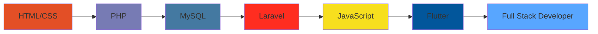

# Hi there! 👋 I'm Surya Pratama

<div align="center">
  
</div>

<div align="center">
  
  
</div>

---

## 🚀 About Me

```javascript
const surya = {
    location: "Bandung, Indonesia 🇮🇩",
    role: "Web Developer",
    code: ["HTML", "CSS", "PHP", "JavaScript"],
    currentFocus: ["Laravel", "Flutter", "Modern Web Technologies"],
    funFact: "CSS still surprises me sometimes! 😅",
    lifePhilosophy: "You don't evolve in crowds, you evolve in silence."
};
```

- 🔭 Currently working on **web development projects**
- 🌱 Learning **Flutter & Laravel** to expand my skillset
- 👯 Open to collaborate on **simple web projects**
- 💬 Ask me about **HTML, CSS, PHP, and web development**
- 🎯 2024 Goal: **Master full-stack development**
- ⚡ Fun fact: **I debug with console.log more than I'd like to admit!**

---

## 🛠️ Tech Stack & Tools

### Frontend Development
<div align="center">
  


</div>

### Backend Development
<div align="center">
  


</div>

### Currently Learning
<div align="center">
  


</div>

### Tools & Environment
<div align="center">
  


</div>

---

## 📊 GitHub Stats

<div align="center">
  
  
</div>

<div align="center">
  
</div>

---

## 🏆 GitHub Achievements

<div align="center">
  
</div>

---

## 💻 Coding Activity

<div align="center">
  
</div>

---

## 🌟 Featured Projects

<div align="center">

[](https://github.com/suryapratama/project-name-1)
[](https://github.com/suryapratama/project-name-2)

</div>

---

## 🎯 Current Goals

- 🚀 **Master Laravel Framework** - Building robust web applications
- 📱 **Learn Flutter Development** - Creating cross-platform mobile apps  
- 🎨 **Improve UI/UX Skills** - Making beautiful and user-friendly interfaces
- 🌐 **Contribute to Open Source** - Giving back to the developer community
- 📚 **Share Knowledge** - Writing blogs and tutorials

---

## 📈 Learning Journey



---

## 🤝 Let's Connect & Collaborate!

<div align="center">
  
[](https://instagram.com/hellbangsur._)
[](https://linkedin.com/in/suryapratama)
[](mailto:surya@example.com)
[](https://github.com/suryapratama)

</div>

---

## 💭 Random Dev Quote

<div align="center">
  
</div>

---

<div align="center">
  
### 🌟 *"You don't evolve in crowds, you evolve in silence."* 🌟

**Thanks for visiting my profile! Feel free to reach out if you'd like to collaborate on any projects!** 


</div>

---

<div align="center">
  <sub>⭐️ From <a href="https://github.com/suryapratama">Surya Pratama</a> with 💙</sub>
</div>
